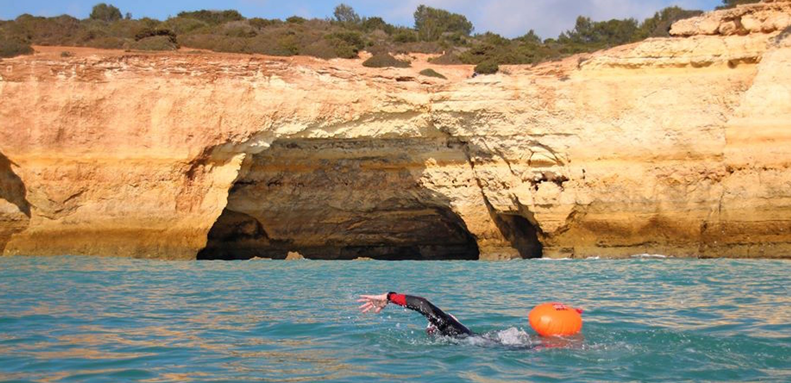
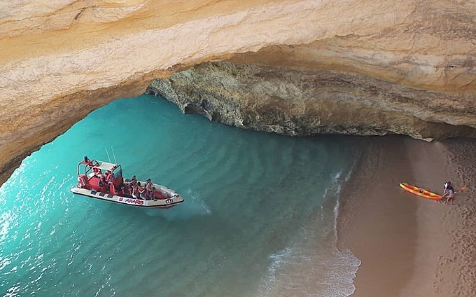
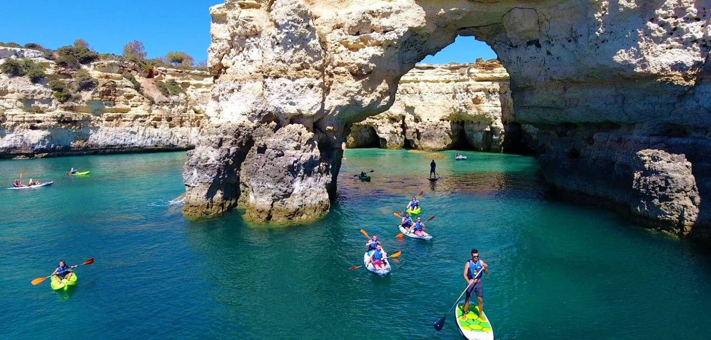

The Benagil Sea Cave is a light-filled dome painted in shades of amber that encloses an intimate beach within its layered walls. You’ll find this quite unique natural creation just around the corner from Benagil, a small fishing village located a short distance away from Lagoa.

# Ways to get to the Cave

## Swimming 

Swimming to the Benagil Sea Cave is not recommended at all if you’re not a strong and experienced swimmer. The waves, the jagged rocks and the capricious oceanic currents can turn your short expedition into a truly perilous Odyssey of about 400 meters (out & back).

## Boat Tour

A boat trip is a good option to visit the Benagil Sea Cave if you don’t know how to handle a kayak at sea; however, during high season, you probably won’t be allowed to step out of the boat and onto the cave’s sandy floor. This is not a rule set in stone, though: please talk to the trip’s operator to discuss concrete details like how much time will the boat spend inside the caves, and whether it is allowed or not to hop off the vessel at a specific cove or cave.

## Kayak

Kayaks can be rented on the spot or from more distant operators. To rent a kayak you’ll need to sign a ‘statement of responsibility’ and to show a valid ID document. A more challenging option to take you into the caves is to use a Stand-up Paddle Board (SUP). However, a SUP will only work if the sea is flat - as it normally is.

